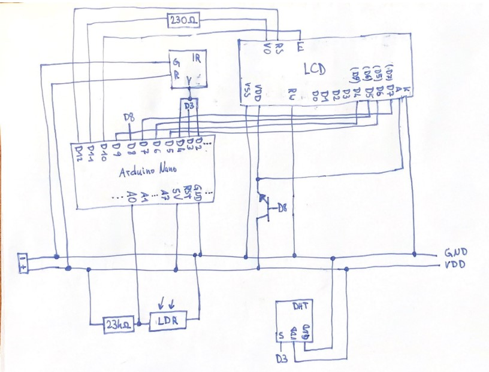
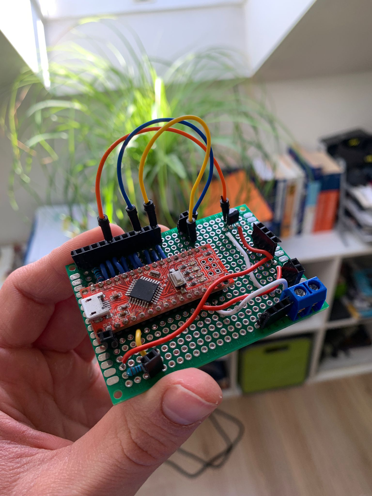

# ArduinoWetterstation
DIY Wetterstation, die Temperatur, Luftfeuchtigkeit und Licht anzeigt. Wird von einem Arduino Nano gesteurt. Das Gehäuse ist 3D-gedruckt und die Wetterstation kann mit einer IR-Fernbedienung bedient werden.  

Die Wetterstation besteht aus einem Arduino Nano, einem 3D-gedruckten Gehäuse, einem LCD-Display und mehreren Sensoren.  
Als Sensoren wurden ein DHT22 für Temperatur / Luftfeuchtigkeit und ein Photowiderstand für Licht verwendet. Außerdem ist ein IR-Empfänger für die Fernbedienung verbaut.  
Auf einem LCD-Display werden dem Benutzer die Temperatur und ein weiterer Wert angezeigt. Mit der Fernbedienung kann dieser zwischen Luftfeuchtigkeit und Lichtstärke umgeschalten werden.  
Die Wetterstation wird über ein 5V-Netzteil mit Strom versorgt. Es gibt einen An/Aus-Schalter am Gehäuse und einen Standy-By-Modus zum Stromsparen und Display-Ausschalten.  

Der Arduino Nano und viele Anschlüsse für Sensoren und Strom wurden auf eine Lochrasterplatine gelötet und verkabelt.

Der Code wurde in C++ mithilfe der Arduino IDE und den entsprechenden Libraries geschrieben.

